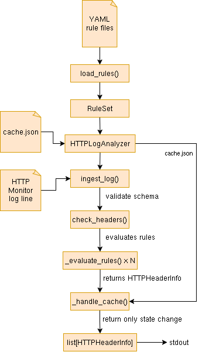

# HTTP Header Security Analyzer

## Overview

`http_header_validator.py` is a rule-driven HTTP header analyzer. It ingests HTTP monitor data, evaluates the response headers found within them against a configurable set of YAML rules, and emits notifications when a header's security posture changes relative to a previous run. Results are cached per URL so only state transitions (a header appearing, disappearing, or changing compliance) produce output.

---

## Architecture

Rules are loaded from YAML files into a topologically sorted `RuleSet`, incoming JSON log entries are validated and their headers evaluated against the ruleset, and a notification is emitted only when a rule's active state differs from the cached value for that URL.



For a full description of components, classes, the evaluation engine, and cache internals see [docs/developer.md](docs/developer.md).

---

## Rule Syntax

Rules are defined in YAML as a list of objects. Each object configures one rule.

### Full structure

```yaml
- header: <string>          # HTTP header name (case-insensitive)
  id: <string>              # Unique rule identifier
  severity: <string>        # CRITICAL | WARNING | INFO
  notify: <bool>            # Whether to emit output on state change
  info: <string>            # Human-readable description shown in output
  constraints:              # All constraint fields are optional
    exists: <bool>          # true = header must be present; false = must be absent
    regex: <string>         # Rule fires if header value matches this pattern
    regex_neg: <string>     # Rule fires if header value does NOT match this pattern
    dependencies:           # List of prerequisite rule outcomes
      - id: <string>        # ID of the rule that must have been evaluated
        activated: <bool>   # true = that rule must have fired; false = must NOT have fired
```

### Field reference

#### `header`
Mandatory. The HTTP response header this rule inspects. Matching is case-insensitive.

```yaml
header: strict-transport-security
```

#### `id`
Mandatory. A unique string identifier for the rule. Used in dependency references and in the cache. Must be unique across all loaded rule files.

```yaml
id: hsts_missing
```

#### `severity`
Optional. Defaults to `NONE`. Attached to the output object for log information value. Does not affect whether a rule fires. Valid values: `CRITICAL`, `WARNING`, `INFO`.

```yaml
severity: CRITICAL
```

#### `notify`
Optional. Defaults to `false`. Controls whether a state change produces output. Set to `true` for rules you want reported. Rules with `notify: false` still participate in dependency checks and are cached, but their results are never printed.

```yaml
notify: true
```

#### `info`
Optional. Defaults to empty string. A human-readable string included in the output. Explain what the finding means and what action to take.

```yaml
info: >
  Strict-Transport-Security is missing. Browsers will not be instructed
  to exclusively use HTTPS, leaving users vulnerable to downgrade attacks.
```

---

### Constraints

All constraint fields are optional and can be combined. A rule fires (goes **active**) only if every specified constraint is satisfied.

#### `exists`

Checks whether the header is present in the response.

- `exists: true` - the rule fires only if the header **is present**
- `exists: false` - the rule fires only if the header **is absent**

```yaml
# Fires (notifies) when HSTS is missing entirely
- header: strict-transport-security
  id: hsts_missing
  severity: CRITICAL
  notify: true
  constraints:
    exists: false
  info: HSTS header is absent.
```

#### `regex`

A regular expression matched against the header's value. The rule fires only if the value **matches** the pattern. Uses `re.search`, so the pattern does not need to match the full string unless anchored with `^` and `$`.

```yaml
# Fires when Access-Control-Allow-Origin is exactly "*"
constraints:
  exists: true
  regex: "^\\*$"
```

#### `regex_neg`

The inverse of `regex`. The rule fires only if the value **does not match** the pattern. Useful for allowlisting known-good values and firing on anything else.

```yaml
# Fires when X-Frame-Options is present but not DENY or SAMEORIGIN
constraints:
  exists: true
  regex_neg: "(?i)^(DENY|SAMEORIGIN)$"
```

`regex` and `regex_neg` can be combined. Both must pass for the rule to fire.

#### `dependencies`

A list of prerequisite rule outcomes. Before evaluating its own constraints, a rule checks that each dependency has (or has not) fired as required. If any dependency condition is not met, the rule immediately goes inactive.

Each dependency entry has two required fields:

 - `id` - the rule ID to check
 - `activated` - `true` means that rule must have fired; `false` means it must not have fired

```yaml
# Only fires when x-xss-protection IS present (the "missing" rule did not fire)
# and the value is not "0"
- header: x-xss-protection
  id: x_xss_protection_enabled
  severity: CRITICAL
  notify: true
  constraints:
    dependencies:
      - id: x_xss_protection_missing
        activated: false
    regex_neg: "^0$"
  info: >
    X-XSS-Protection is enabled. Set it to 0 or remove it entirely.
```

Because the loader sorts rules topologically, a dependency's outcome is always known before the dependent rule runs. Circular dependencies cause loading to fail.

For constraint evaluation order and complete worked examples see [docs/developer.md](docs/developer.md).

## LLM Rules Generation

Rulesets can be generated and maintained with the help of an LLM. Two paths are available depending on your tooling.

### `/generate-ruleset` — Claude Code skill (recommended)

The project ships a Claude Code slash command that automates the full generation workflow. It handles fetching source pages, building a plan for review, generating rule YAML, and writing the output file.

**Prerequisites**: [Claude Code](https://claude.ai/code) installed and a session opened in this project directory.

**Invocation**:

```
/generate-ruleset [use-case] [output-path]
```

Both arguments are optional — the skill asks for them if not provided.

| Use case | What it does |
|---|---|
| `from-url` | Fetch a best-practices page (e.g. OWASP) and generate a ruleset from its recommendations |
| `update` | Compare an existing ruleset against the current content of its source URL and apply changes |
| `endpoint` | Generate a ruleset from a JSON snapshot of headers observed on a specific endpoint |
| `audit` | Review an existing ruleset for structural issues and coverage gaps, then output a corrected version |

**Interactive flow**:

1. The skill collects any missing inputs (URL, existing YAML path, or headers JSON).
2. If rules that depend on endpoint context are found (e.g. rules that only apply to HTML pages or authenticated endpoints), the skill presents them separately and asks whether to provide context or skip them.
3. The skill opens Claude Code's **Plan mode** showing the proposed rule list as a table. Review it, request changes if needed, then approve.
4. The YAML is generated and written to the output path.

**Example**:

```
/generate-ruleset from-url ruleset/my_rules.yaml
```

The skill source file is at [`skill/generate-ruleset.md`](skill/generate-ruleset.md). It is self-contained — the JSON schema and all generation constraints are embedded directly so it works without any external dependencies. See [`docs/deployment.md`](docs/deployment.md) for installation instructions.

### Manual prompts (any LLM)

For use with any LLM outside Claude Code, see [`docs/prompts.md`](docs/prompts.md) for the full prompt library with system prompts, structured constraints, and use-case templates.

## Script running

```bash
python3 http_header_validator.py \
  --rules ruleset/owasp.yaml \
  --log-file data/http_logs.json \
  --cache /tmp/http_validator_cache.json
```

For the full CLI reference, log file format, and output format see [docs/usage.md](docs/usage.md).
